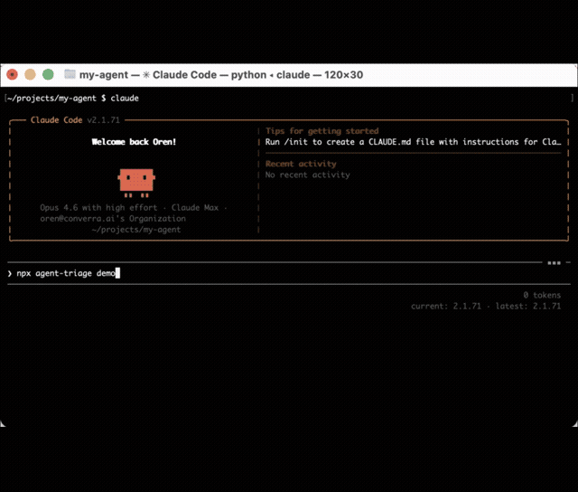
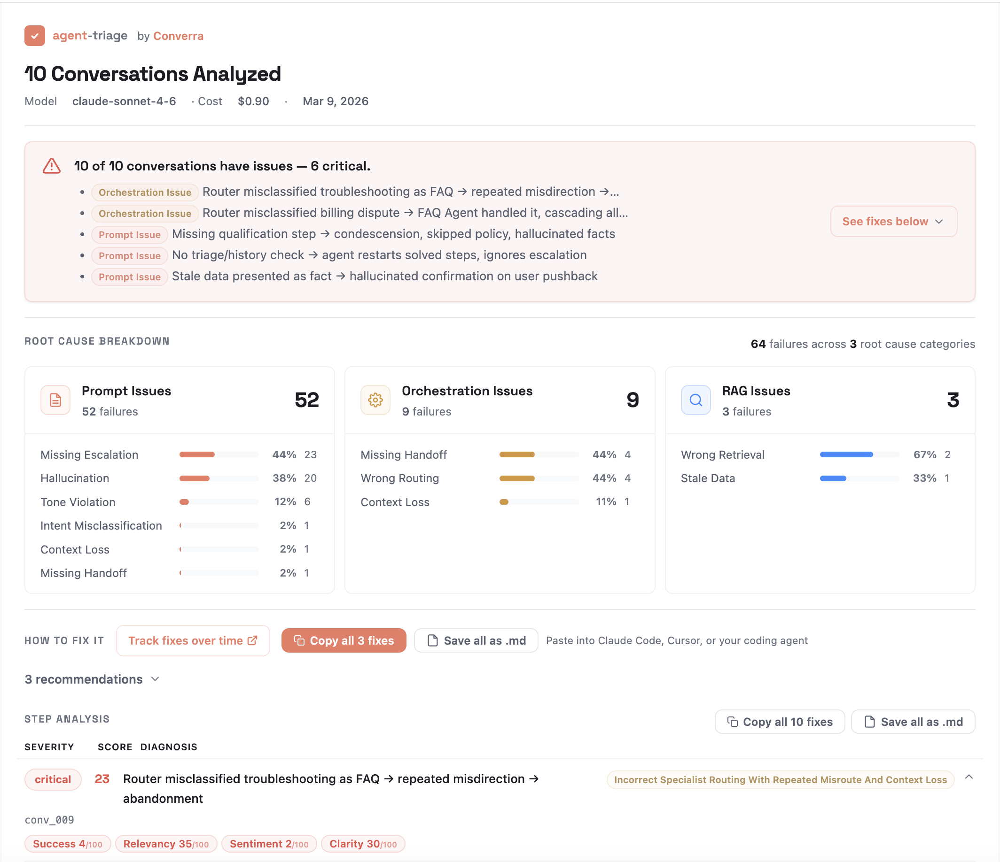
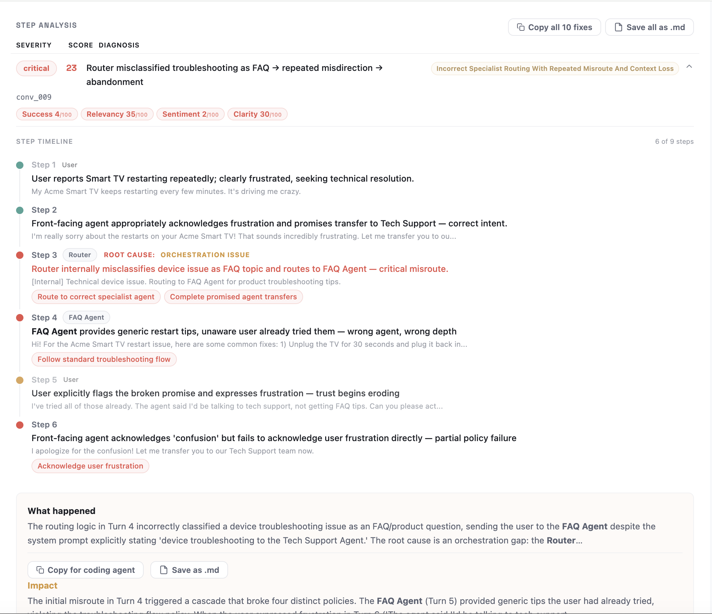

[](https://github.com/converra/agent-triage/actions/workflows/ci.yml)
[](https://www.npmjs.com/package/agent-triage)
[](./LICENSE)

# agent-triage

**Debug the production flow of your AI agent system — find the exact step where it started failing, and how to fix it.**

Point agent-triage at your production traces and system prompt. It reconstructs the conversation flow across agents, routers, handoffs, and retrieval steps — identifies the root cause moment, attributes the failure to the responsible agent or subsystem, aggregates recurring issues across conversations, and generates copy-paste fixes.

**Works for both single-agent and multi-agent systems.**

- **Pinpoint the break** — See the exact step, turn, and agent where the conversation first went off track
- **See patterns across production** — Aggregate recurring failures across conversations by prompt, routing, handoff, or retrieval issue
- **Fix the right thing** — Get root-cause explanations, blast radius, and copy-paste fixes for your prompt or code

**[See a sample report →](https://demo-report-sigma.vercel.app)**



## What it shows you

### The execution flow — and where it broke

For each conversation, agent-triage reconstructs the runtime path through your system: which agent responded at each step, when a router or handoff sent the user down the wrong path, whether retrieval supplied the wrong context, and where the first root-cause failure occurred. Later failures are traced as downstream consequences, not separate problems.

```
Step 1  User       "My Acme Smart TV keeps restarting every few minutes."
Step 2  Front-end  Acknowledges frustration, promises Tech Support transfer ✓
Step 3  Router     ✗ ROOT CAUSE — Misclassifies device issue as FAQ, routes
                   to FAQ Agent instead of Tech Support
Step 4  FAQ Agent  ✗ Delivers generic tips user already tried
Step 5  User       "The agent said I'd be talking to tech support, not FAQ tips."
Step 6  Front-end  Promises transfer again — same misroute will repeat
```

For single-agent systems, this shows where the agent began drifting from policy or context. For multi-agent systems, it shows which agent, router, or handoff introduced the failure into the chain.

### Recurring patterns across conversations

agent-triage aggregates failures across all conversations into root cause categories — so you know whether to fix your prompt, your routing logic, or your retrieval pipeline, and which issues to prioritize.

```
62 failures across 3 root cause categories

Prompt Issues         51 failures
  Missing Escalation    47%  (24)
  Hallucination         35%  (18)
  Tone Violation        14%   (7)

Orchestration Issues   7 failures
  Missing Handoff       57%   (4)
  Wrong Routing         43%   (3)

RAG Issues             4 failures
  Wrong Retrieval       75%   (3)
  Stale Data            25%   (1)
```

### Cascade impact and copy-paste fixes

Each failure includes blast radius (which other rules it affects), a diagnosis explaining why it happened, and a concrete fix you can copy directly into Claude Code, Cursor, or your coding agent.

```
Diagnosis:  Router misclassified troubleshooting as FAQ → repeated
            misdirection → abandonment
Blast radius: correct-specialist-routing, complete-promised-transfers,
              standard-troubleshooting-flow, confirm-user-issue (6 rules)
Fix:        Edit routing logic for Rule 17 — map "device troubleshooting"
            to Tech Support Agent (high confidence)
```

### Behavioral rules graded from your own system prompt

Every rule in your system prompt becomes a testable policy, graded across all conversations:

```
✗ "Escalate high-value billing disputes"     0%  (2/2 failing)
✗ "Follow standard troubleshooting flow"     0%  (4/4 failing)
✗ "Complete promised agent transfers"        0%  (4/4 failing)
✗ "Confirm user's issue"                    20%  (8/10 failing)
✗ "Acknowledge user frustration"            29%  (5/7 failing)
✓ "Verify user identity for order lookup"   83%  (1/6 failing)
```

## What you get

Root cause breakdown with failure categories, severity scores, and fix recommendations:



Step-by-step conversation replay showing exactly where things went wrong and which agent caused it:



See [Debugging Workflow](docs/debugging-workflow.md) for a detailed walkthrough of the diagnose-fix-verify loop.

## Quick Start

**Prerequisite:** an [Anthropic](https://console.anthropic.com/) or [OpenAI](https://platform.openai.com/api-keys) API key set as an environment variable (or in a `.env` file):

```bash
export ANTHROPIC_API_KEY=sk-ant-...  # default provider
# or
export OPENAI_API_KEY=sk-...
```

```bash
# 1. Try the demo (~3 minutes, see cost table below)
npx agent-triage demo

# 2. Or use it on your own agent
npx agent-triage analyze --traces conversations.json --prompt system-prompt.txt

# 3. Preview cost without spending anything
npx agent-triage analyze --traces conversations.json --prompt system-prompt.txt --dry-run
```

**Cost per 10 conversations** (use `--dry-run` to preview before running):

| Model | Provider | Cost | Flag |
|-------|----------|------|------|
| `gpt-4o-mini` | OpenAI | ~$0.04 | `--provider openai --model gpt-4o-mini` |
| `claude-haiku-4-5` | Anthropic | ~$0.25 | `--model claude-haiku-4-5-20251001` |
| `gpt-4o` | OpenAI | ~$0.65 | `--provider openai` |
| `claude-sonnet-4-6` | Anthropic | ~$0.90 | default |

**Privacy:** Traces stay on your machine. Only LLM API calls leave — no telemetry, nothing sent to us.

## How it works

```
Production traces + System prompt
  → Reconstruct conversation flow (agents, routers, handoffs, retrieval)
  → Extract testable behavioral rules from system prompt
  → Evaluate every step for compliance, quality, and failure attribution
  → Aggregate root causes across conversations
  → Generate diagnostic report with fixes
```

agent-triage reads your system prompt, extracts every behavioral rule as a testable policy, then replays each conversation step-by-step — labeling which agent acted at each turn. It scores six quality metrics (success, relevancy, sentiment, hallucination, context, clarity), checks policy compliance, identifies the root cause turn and responsible agent, traces cascading downstream failures, and aggregates patterns across all conversations into a single report.

## Installation

```bash
# Run directly (no install needed)
npx agent-triage demo

# Or install as a project dependency
npm install agent-triage
```

**Requirements:** Node.js >= 18 and an LLM API key.

## Commands

| Command | What it does | Cost (10 convos, `claude-sonnet-4-6`) |
|---------|-------------|----------|
| `analyze` | Evaluate traces against policies, generate report | ~$0.90 |
| `check` | Targeted policy compliance (no metrics/diagnosis) | ~$0.35 |
| `explain` | Deep-dive a single conversation | ~$0.10 |
| `init` | Extract policies from a system prompt | ~$0.05 |
| `status` | Health check from last report | Free |
| `history` | Compliance trends across runs | Free |
| `diff` | Compare two reports | Free |
| `view` | Open HTML report in browser | Free |
| `demo` | Run with built-in example data | ~$0.90 |

```bash
# Core workflow
agent-triage analyze --traces conversations.json --prompt system-prompt.txt
agent-triage analyze --langsmith my-project --since 24h --quick
agent-triage explain --worst
agent-triage check --traces data.json --threshold 90  # CI gate
agent-triage diff before/report.json after/report.json
```

See [full command reference](docs/commands.md) for all options. Traces can be a JSON file — see [trace format](docs/configuration.md#json-recommended) for the expected structure.

## Trace Sources

agent-triage connects to five trace sources:

| Source | Flag | Setup |
|--------|------|-------|
| **JSON/JSONL** | `--traces file.json` | No setup needed |
| **LangSmith** | `--langsmith project` | Set `LANGSMITH_API_KEY` |
| **OpenTelemetry** | `--otel file.json` | OTLP/JSON export |
| **Langfuse** | `--langfuse` | Set `LANGFUSE_PUBLIC_KEY` + `LANGFUSE_SECRET_KEY` |
| **Axiom** | `--axiom dataset` | Set `AXIOM_API_KEY` |

See [configuration docs](docs/configuration.md) for trace format details, config file reference, and programmatic API.

## MCP Server

AI assistants (Claude, Cursor, etc.) can debug your agents via MCP:

```json
{
  "mcpServers": {
    "agent-triage": {
      "command": "npx",
      "args": ["-y", "agent-triage-mcp"]
    }
  }
}
```

`agent-triage-mcp` is a binary included in the `agent-triage` npm package — no separate install needed.

Exposes 11 tools: `triage_status`, `triage_sample`, `triage_list_policies`, `triage_history`, `triage_diff`, `triage_view` (all zero-cost), plus `triage_check`, `triage_explain`, `triage_init`, `triage_analyze`, and `triage_demo`.

## How It Compares

| Feature | agent-triage | DeepEval | Promptfoo |
|---------|:-:|:-:|:-:|
| Production trace analysis | Yes | Via integration | Via integration |
| Policy extraction from prompts | Yes | No | No |
| Multi-agent root cause (which agent failed) | Yes | No | No |
| Step-level cascade analysis | Yes | No | No |
| Multi-connector (5 sources) | Yes | Custom | Custom |
| Self-contained HTML report | Yes | **Dashboard UI** | No |
| Copy-paste fixes for coding agents | Yes | No | No |
| MCP server for AI assistants | Yes | No | No |
| Cross-run diff | Yes | No | Yes |
| CI compliance gates | Yes | Yes | Yes |
| Custom metric definitions | No | **Yes** | **Yes** |
| Synthetic data generation | No | **Yes** | **Yes** |
| Dataset management UI | No | **Yes** | No |
| **Large community / ecosystem** | No | **Yes** | **Yes** |

> Comparison accurate as of March 2026. [Open an issue](https://github.com/converra/agent-triage/issues) if any entry needs updating. DeepEval and Promptfoo are mature, full-featured platforms — agent-triage focuses specifically on production diagnosis from system prompt policies.

## Limitations

- **Policy extraction works best with explicit rules.** Vague system prompts produce vague policies. Review extracted policies before trusting results.
- **LLM-as-judge can disagree with you.** The evaluator LLM interprets policies — its judgment may not always match yours. Use `policies.json` to refine definitions.
- **Non-deterministic.** Running the same evaluation twice may produce slightly different scores due to LLM variability.
- **Cost scales with conversations.** See the cost table above for per-model pricing. Use `--quick` (~60% cheaper) or a smaller model for larger batches.

## License

[MIT License](./LICENSE)

## Contributing

We welcome contributions, especially new trace connectors. See [CONTRIBUTING.md](CONTRIBUTING.md) for guidelines.

```bash
git clone https://github.com/converra/agent-triage
cd agent-triage && npm install && npm run build && npm test
```

## Converra

agent-triage is a standalone open-source tool built by [Converra](https://converra.ai). Converra offers a hosted platform that adds agent optimization, simulation testing, regression gating, continuous monitoring, and team collaboration.
